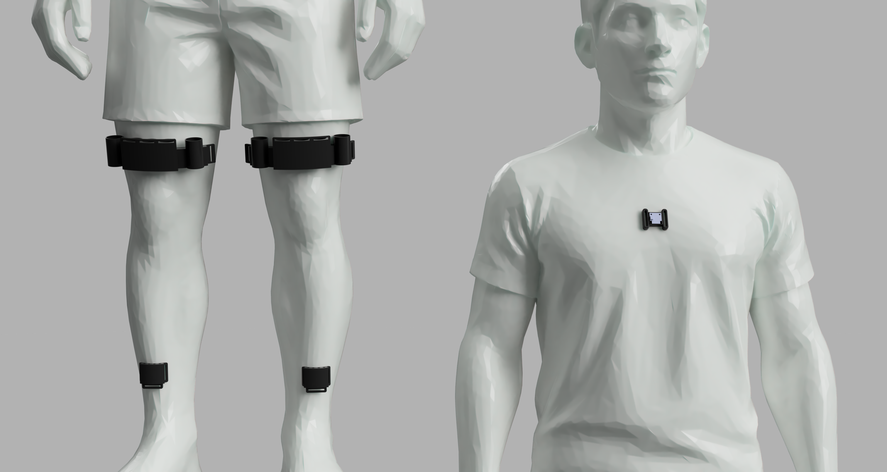

# TSA Wearable Exosuit — Sit-to-Stand Assistance

<p align="center">
  
</p>

A Twisted String Actuator (TSA) based wearable exosuit designed to assist users through sit-to-stand (STS) motions. Motor performance is optimised using Proximal Policy Optimisation (PPO). An IMU-based intention detection system determines when to trigger the device, and a MuJoCo/MyoSuite musculoskeletal simulation validates the assist strategy before physical deployment.

---

## Results

- **Muscle activation reduction:** 10% reduction in lower-limb muscle activation on a single test subject
- **Intention detection accuracy:** 84.38% overall — limited by false positives from similar forward-lean motions (e.g. bending to tie shoelaces)
- **Control optimisation:** PPO-optimised TSA parameters (string length, staggered motor activation times) minimise quadriceps demand while tracking baseline kinematics

---

## System Overview

```
┌─────────────────────────────────────────────────────┐
│                   Wearable Exosuit                  │
│                                                     │
│  ┌──────────────────┐     ┌──────────────────────┐  │
│  │ Intention        │────▶│ Hardware Control     │  │
│  │ Detection (IMU)  │     │ (TSA Motors + EMG)   │  │
│  └──────────────────┘     └──────────────────────┘  │
│                                    ▲                │
│  ┌──────────────────┐              │                │
│  │ Simulation &     │──── PPO ─────┘                │
│  │ Optimisation     │  optimised params             │
│  └──────────────────┘                               │
└─────────────────────────────────────────────────────┘
```

The three subsystems map directly to the three directories in this repository.

---

## Repository Structure

```
COMP0225-Group3/
│
├── Hardware/
│   ├── MotoronWifiControl.ino   # Arduino firmware — motor control + EMG logging
│   └── Renders/
│       └── ExoSuit_v4.png       # CAD render of the physical device
│
├── IntentionDetection/
│   ├── intent-detect.py         # Finite state machine — real-time STS intent detection
│   ├── complimentary-filter.py  # Complementary filter orientation estimate
│   ├── madgwick-filter.py       # Madgwick filter implementation
│   ├── visualise.py             # Sensor data visualisation
│   ├── read-all.py              # Raw IMU data logger
│   └── icm20948-python-main/    # ICM-20948 IMU driver (third-party)
│
└── Simulation/                  # See Simulation/README.md for full detail
    ├── train_ppo.py             # PPO training — torque-tracking reward
    ├── train_ppo_min_control.py # PPO training — min-control / baseline-tracking
    ├── train_ppo_feedback.py    # PPO training — multi-step feedback controller
    ├── run_optimal.py           # Replay best PPO policy
    ├── ctrl_optim/              # PPO wrappers, STS reflex controller, TSA integration
    ├── tsa_modelling/           # TSA physics (string geometry + motor ODE)
    └── myoassist/               # MyoSuite fork with TorsoLegs environment
```

---

## Hardware

The physical exosuit uses four Motoron motor controllers (I²C addresses 1–4), each driving two motors, giving eight TSA motors in total (four per leg). The microcontroller is an Arduino GIGA R1, which runs the firmware at `Hardware/MotoronWifiControl.ino`.

**Key firmware features:**

- Wi-Fi web interface for manual speed control and braking during development
- Continuous EMG logging via a MyoWare sensor on analogue pin A0 (12-bit, 50 ms interval)
- Acceleration and deceleration limits (400 counts/s²) on all motors to prevent jerk
- Three control modes: `DRIVE`, `BRAKE` (active braking at 800 counts), and `COAST`
- Command timeout (2 s) — motors safe-stop automatically if communication is lost

The TSA motors are twisted-string actuators: a brushed DC motor winds a pair of strings, converting rotation into linear contraction. This contraction applies an extension torque at the knee joint without any rigid linkage on the exosuit frame.

---

## Intention Detection

**Directory:** `IntentionDetection/`

The intention detection system uses an ICM-20948 9-DOF IMU mounted on the torso. Orientation is estimated in real time using a Madgwick filter (quaternion-based, fused accelerometer + gyroscope + magnetometer). The filtered pitch angle and its rate of change feed a finite state machine that fires a motor trigger when a sit-to-stand intent is confirmed.

**Detection rules (all must hold simultaneously):**

| Rule | Condition | Value |
|------|-----------|-------|
| Forward lean | Pitch > threshold | 15° |
| Active lean | Pitch velocity > threshold | 20°/s |
| Positive acceleration | Smoothed pitch accel > 0 | 10-sample window |
| Sustained | Held for duration | 300 ms |
| Cooldown | Minimum gap between triggers | 5 s |

**Performance:** 84.38% overall accuracy. The primary source of false positives is other forward-lean motions — bending over to tie shoelaces, pick something up from the floor, etc. — which produce a similar pitch signature.

Additional scripts:

- `complimentary-filter.py` — earlier complementary filter orientation estimate
- `visualise.py` — real-time and post-hoc sensor data plots
- `read-all.py` — raw IMU data logger for offline analysis

---

## Simulation & Optimisation

**Directory:** `Simulation/` — see [`Simulation/README.md`](Simulation/README.md) for full documentation.

A MuJoCo/MyoSuite simulation drives the optimisation. The musculoskeletal model (`TorsoLegs`) has ~80 Hill-type muscles. A 4-phase reflex-based biological controller executes the STS motion; the TSA exosuit layer injects additional knee-extension torque on top.

**TSA physics** are modelled explicitly:

- String contraction: `X(θ) = L − sqrt(L² − (θ·r)²)`
- Motor dynamics: RK4 ODE integrator, handles stall and wall conditions
- 4-motor-per-leg layout with staggered activation times and symmetric frontal moment cancellation

**Three PPO pipelines** are implemented, all using Stable Baselines 3:

| Pipeline | Optimises | Reward focus |
|----------|-----------|--------------|
| Torque-tracking | String length + 4 activation times | Minimise torque under-delivery |
| Min-control | String length + 4 activation times | Reduce VAS activation, track baseline kinematics |
| Feedback | Per-step torque commands | Real-time adaptive assist (22-feature observation) |

The min-control pipeline was used to derive the parameters deployed on the physical device.

### Quick Start

```bash
# Activate simulation environment
source Simulation/myoassist/.myo-venv/bin/activate

# Run one STS episode manually
mjpython Simulation/base_code.py

# Train with min-control PPO
mjpython Simulation/train_ppo_min_control.py --timesteps 5000 --out Simulation/logs/test_run

# Evaluate best parameters
mjpython Simulation/ctrl_optim/eval_best_min_control.py --run Simulation/logs/test_run
```

All simulation scripts require `mjpython` (MuJoCo's bundled Python runtime). See `Simulation/README.md` for the full command reference, configuration options, evaluation scripts, and plotting tools.
